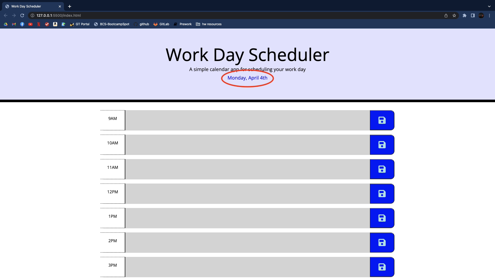
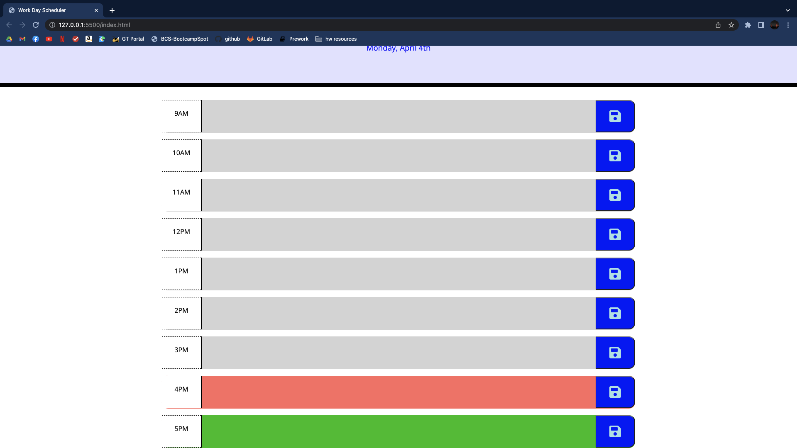
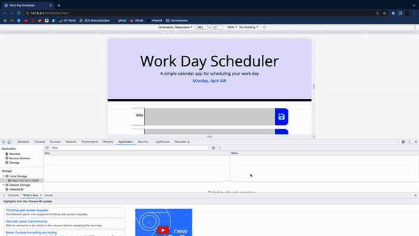

# Homework 5: Work Day Scheduler

## Description 

For this week's homework, we were provided starter code to create a Work Day Scheduler for a busy employee/employer. Since it had starter code to begin with, it was fairly easy to add the classes and IDs that it already had in the CSS stylesheet to the HTML and really gave me some insight on how to complete this assignment. 

As always, here is the **User Story** and **Acceptance Criteria**:

## User Story

```md
AS AN employee with a busy schedule
I WANT to add important events to a daily planner
SO THAT I can manage my time effectively
```

## Acceptance Criteria

```md
GIVEN I am using a daily planner to create a schedule
WHEN I open the planner
THEN the current day is displayed at the top of the calendar
WHEN I scroll down
THEN I am presented with timeblocks for standard business hours
WHEN I view the timeblocks for that day
THEN each timeblock is color coded to indicate whether it is in the past, present, or future
WHEN I click into a timeblock
THEN I can enter an event
WHEN I click the save button for that timeblock
THEN the text for that event is saved in local storage
WHEN I refresh the page
THEN the saved events persist
```

## Installation

Here is my Github Repo and Github Pages (Deployed) to deploy the application in case you need a simple scheduler that'll save your events even after refreshing the page!
- Github Repo: https://github.com/jasonchun7/hw-5-workday-scheduler
- Deployed: https://jasonchun7.github.io/hw-5-workday-scheduler/

## Usage

You're greeted with a main header reading "Work Day Scheduler" with a small paragraph and the current day in the format of the day of the Week, the Month, and the Date in blue text. 



As you scroll down, you'll notice the time blocks are color coded to indicate whether it's in the past (grey), present (red) or future (green):



No matter what time you're saving an event, it will save to local storage and remain that way even after you refresh the page:



## Credits

I had some trouble figuring out how to assign each time block the appropriate classes whether it was the past, present, or future. Hence, I've referenced some of my code to 'mmeii' from her Github Repo:
- https://github.com/mmeii/work-day-scheduler